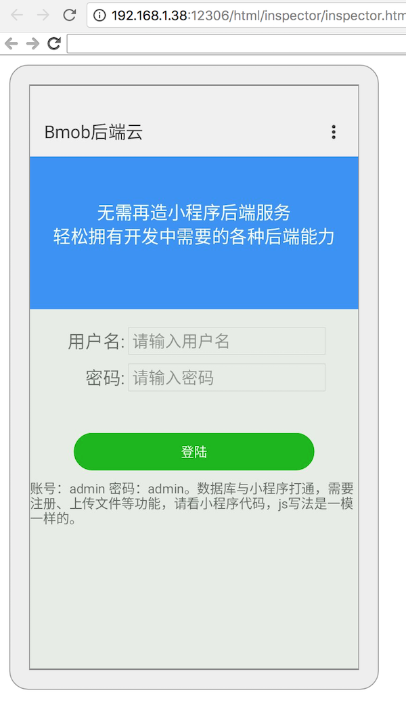

# 快应用开发示例

### 介绍

此代码基于快应用研发，里面嵌入SDK有用Bmob 所有接口的调用能力。

**应用根目录**

```
├── manifest.json
├── app.ux
├── Page1
│   ├── page1.ux
├── Page2
│   ├── page2.ux
└── Common
    ├── ComponentA.ux
    ├── ComponentB.ux
    └── xxx.png
```

其中Common目录下为公用的资源文件和组件文件，每个页面目录下存放各自页面私有的资源文件和组件文件，如：图片，CSS，JS等


### 运行

以下代码进入项目根目录执行


安装依赖

```
npm install
```


编译

```
npm run build
```


运行

```
npm run server
```


调试开启实时编译

```
npm run watch
```


然后手机扫描二维码预览，需要注意的是，手机跟电脑必须同一个wifi


### 演示效果




## 安装使用

### 下载

> https://github.com/bmob/hydrogen-js-sdk/

### 安装使用

 **简介：**

1. 整个SDK，就dist目录下Bmob.*.js 这个文件即可使用全部功能
2. 目前支持H5、小程序、weex、快应用等常见JavaScript引擎


**引入：**

```
import Bmob from '../assets/js/Bmob-hap.1.1.1.min.js'
```


### **初始化**

```
Bmob.initialize("你的Application ID", "你的REST API Key");
```

> 接下来就可参照Bmob文档使用，此代码实现了打通后端数据库登陆功能。如果之前有使用Bmob写过小程序或H5，代码可以复制到快应用，不只是数据库夸平台，客户端js函数也是跨平台的。


### 开发文档地址

http://doc.bmob.cn/data/wechat_app_new/

